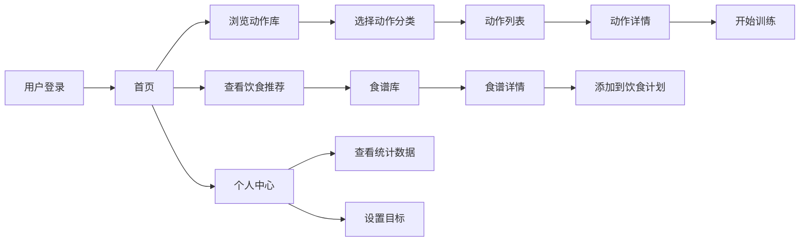

## 1. Product Overview
一款专注于健身动作指导和每日饮食规划的健康管理小程序，帮助用户科学地进行运动训练和饮食控制，实现健康目标。
- 为健身爱好者和健康追求者提供专业的动作指导和个性化饮食建议
- 通过科学的数据驱动，帮助用户高效达成健身目标

## 2. Core Features

### 2.1 User Roles
| Role | Registration Method | Core Permissions |
|------|---------------------|------------------|
| Normal User | Email registration | Browse exercises, view meal plans, track progress |

### 2.2 Feature Module
1. **首页**: 今日计划概览、快捷入口、数据统计
2. **动作库**: 健身动作分类浏览、动作详情、训练计划
3. **饮食页**: 每日饮食推荐、食谱库、营养成分查询
4. **个人中心**: 用户资料、健身目标、历史记录

### 2.3 Page Details
| Page Name | Module Name | Feature description |
|-----------|-------------|---------------------|
| 首页 | 今日概览 | 显示今日训练计划和饮食安排，包含卡路里摄入/消耗统计 |
| 首页 | 快捷入口 | 快速进入动作库、饮食推荐、个人中心 |
| 动作库 | 分类浏览 | 按部位（胸部、背部、腿部等）或类型（力量、有氧、拉伸）分类 |
| 动作库 | 动作列表 | 展示动作名称、难度、目标肌群 |
| 动作详情 | 动作说明 | 动作名称、目标肌群、难度等级、组数次数建议 |
| 动作详情 | 动作演示 | 动作图片或GIF动画演示 |
| 动作详情 | 注意事项 | 动作要点和安全提示 |
| 饮食页 | 今日饮食 | 早中晚餐推荐，包含热量和营养成分 |
| 饮食页 | 食谱库 | 按类型（减脂、增肌、均衡）分类的食谱列表 |
| 饮食详情 | 食谱信息 | 食材清单、制作步骤、营养成分表 |
| 个人中心 | 用户资料 | 昵称、头像、身高体重、健身目标 |
| 个人中心 | 数据统计 | 累计训练天数、完成动作数、饮食记录 |
| 个人中心 | 设置 | 目标设置、偏好设置 |

## 3. Core Process
用户登录后进入首页，查看今日训练和饮食计划。可以浏览动作库选择想要训练的动作，查看详细指导进行训练。同时可以查看饮食推荐，选择合适的食谱。在个人中心查看自己的健身数据和历史记录。

## 4. User Interface Design

### 4.1 Design Style
- **主色调**: 活力橙色 (#FF6B35) - 代表热情和能量
- **辅色调**: 健康绿色 (#4CAF50) - 代表健康和自然
- **中性色**: 深灰 (#333333)、浅灰 (#F5F5F5)
- **按钮风格**: 圆角矩形，主按钮橙色渐变，次按钮白色边框
- **字体**: 标题使用粗体无衬线字体，正文使用清晰易读的无衬线字体
- **布局风格**: 卡片式布局，干净整洁，信息层次分明
- **图标风格**: 线性图标，简洁现代

### 4.2 Page Design Overview
| Page Name | Module Name | UI Elements |
|-----------|-------------|-------------|
| 首页 | 顶部Banner | 渐变背景、健身激励语、日期显示 |
| 首页 | 今日数据卡片 | 卡路里摄入/消耗、训练时长、完成度进度条 |
| 首页 | 快捷入口区 | 四个圆形图标按钮：动作库、饮食、训练、统计 |
| 动作库 | 分类标签栏 | 横向滚动的分类标签 |
| 动作库 | 动作卡片 | 图片、名称、难度标识、目标肌群标签 |
| 动作详情 | 动作演示区 | 大图或GIF展示，播放控制 |
| 动作详情 | 信息面板 | 难度、组数、次数、休息时间 |
| 饮食页 | 三餐卡片 | 早餐/午餐/晚餐卡片，显示食物图片和热量 |
| 饮食页 | 营养仪表盘 | 蛋白质、碳水、脂肪摄入比例环形图 |
| 个人中心 | 用户卡片 | 头像、昵称、目标状态 |
| 个人中心 | 统计图表 | 周训练次数柱状图、月体重变化折线图 |

### 4.3 Responsiveness
- **移动端优先设计**: 适配手机屏幕，触控友好
- **响应式布局**: 使用弹性布局，适配不同屏幕尺寸
- **触控优化**: 按钮尺寸≥44px，卡片间距合理，操作区域清晰

### 4.4 3D Scene Guidance (Not applicable)
本项目不涉及3D场景。
