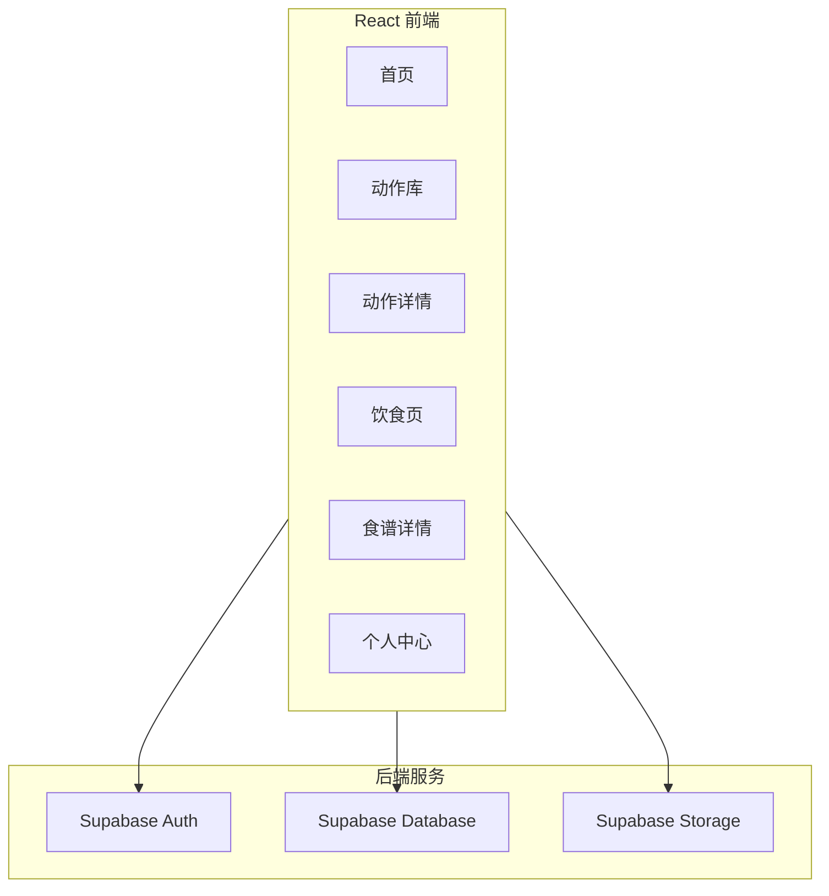
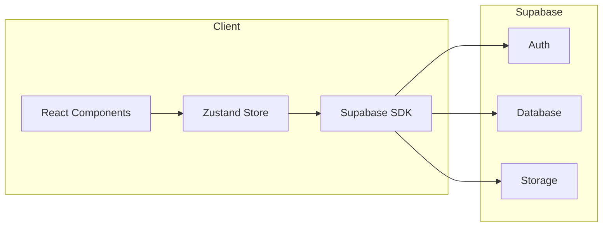
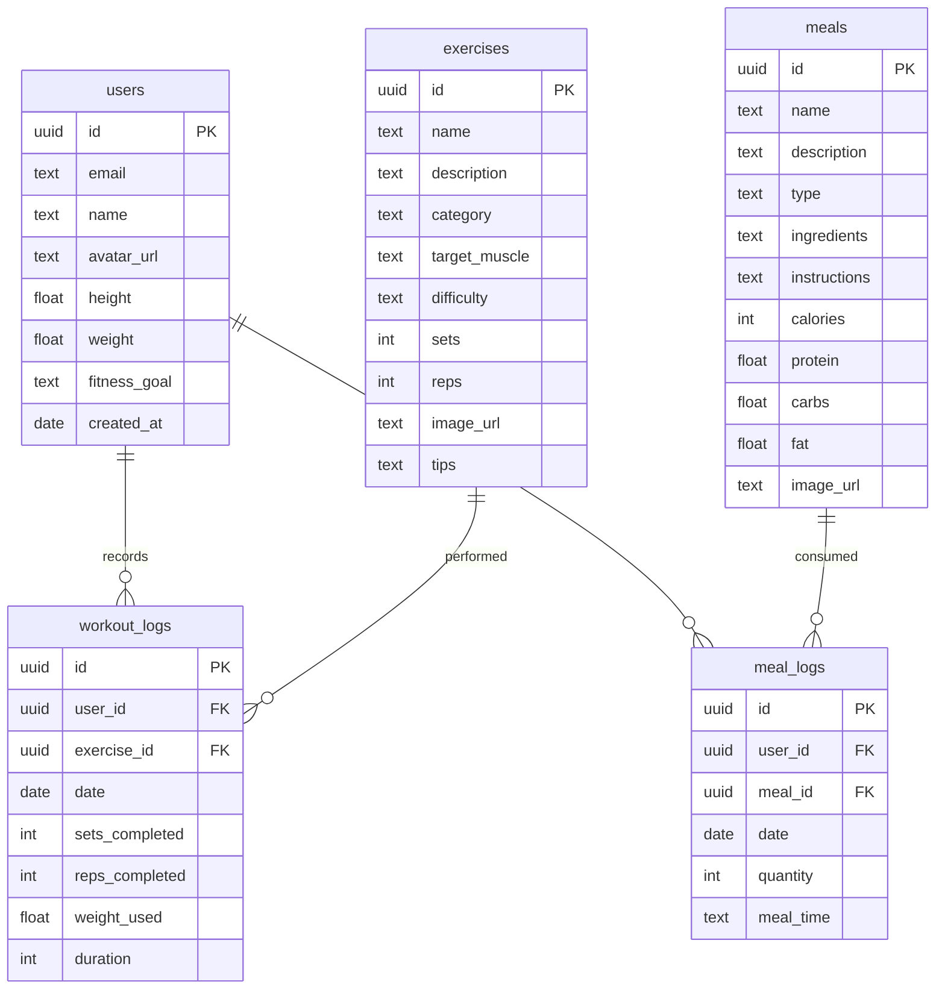

## 1. Architecture Design



## 2. Technology Description
- **Frontend**: React@18 + TypeScript + TailwindCSS@3 + Vite
- **Initialization Tool**: vite-init
- **Backend**: Supabase (Auth, Database, Storage)
- **State Management**: Zustand
- **Routing**: React Router DOM
- **Icons**: Lucide React
- **Charting**: Chart.js / react-chartjs-2

## 3. Route Definitions
| Route | Purpose |
|-------|---------|
| / | 首页 - 今日计划概览 |
| /exercises | 动作库 - 健身动作分类浏览 |
| /exercises/:id | 动作详情 - 动作指导和演示 |
| /meals | 饮食页 - 每日饮食推荐 |
| /meals/:id | 食谱详情 - 详细食谱信息 |
| /profile | 个人中心 - 用户资料和统计 |

## 4. API Definitions

### 4.1 Exercise API
| Method | Endpoint | Purpose |
|--------|----------|---------|
| GET | /api/exercises | 获取所有动作列表 |
| GET | /api/exercises/:id | 获取单个动作详情 |
| GET | /api/exercises?category=:category | 按分类筛选动作 |

### 4.2 Meal API
| Method | Endpoint | Purpose |
|--------|----------|---------|
| GET | /api/meals | 获取所有食谱列表 |
| GET | /api/meals/:id | 获取单个食谱详情 |
| GET | /api/meals?type=:type | 按类型筛选食谱 |

### 4.3 User API
| Method | Endpoint | Purpose |
|--------|----------|---------|
| GET | /api/users/:id | 获取用户资料 |
| PUT | /api/users/:id | 更新用户资料 |
| GET | /api/users/:id/progress | 获取用户健身进度 |

## 5. Server Architecture Diagram



## 6. Data Model

### 6.1 Data Model Definition



### 6.2 Data Definition Language

```sql
CREATE TABLE users (
    id UUID PRIMARY KEY DEFAULT gen_random_uuid(),
    email TEXT UNIQUE NOT NULL,
    name TEXT,
    avatar_url TEXT,
    height FLOAT,
    weight FLOAT,
    fitness_goal TEXT,
    created_at DATE DEFAULT CURRENT_DATE
);

CREATE TABLE exercises (
    id UUID PRIMARY KEY DEFAULT gen_random_uuid(),
    name TEXT NOT NULL,
    description TEXT,
    category TEXT NOT NULL,
    target_muscle TEXT,
    difficulty TEXT NOT NULL,
    sets INT DEFAULT 3,
    reps INT DEFAULT 10,
    image_url TEXT,
    tips TEXT
);

CREATE TABLE meals (
    id UUID PRIMARY KEY DEFAULT gen_random_uuid(),
    name TEXT NOT NULL,
    description TEXT,
    type TEXT NOT NULL,
    ingredients TEXT,
    instructions TEXT,
    calories INT NOT NULL,
    protein FLOAT DEFAULT 0,
    carbs FLOAT DEFAULT 0,
    fat FLOAT DEFAULT 0,
    image_url TEXT
);

CREATE TABLE workout_logs (
    id UUID PRIMARY KEY DEFAULT gen_random_uuid(),
    user_id UUID REFERENCES users(id),
    exercise_id UUID REFERENCES exercises(id),
    date DATE DEFAULT CURRENT_DATE,
    sets_completed INT,
    reps_completed INT,
    weight_used FLOAT,
    duration INT
);

CREATE TABLE meal_logs (
    id UUID PRIMARY KEY DEFAULT gen_random_uuid(),
    user_id UUID REFERENCES users(id),
    meal_id UUID REFERENCES meals(id),
    date DATE DEFAULT CURRENT_DATE,
    quantity INT DEFAULT 1,
    meal_time TEXT
);

GRANT SELECT ON exercises TO anon;
GRANT SELECT ON meals TO anon;
GRANT ALL PRIVILEGES ON users TO authenticated;
GRANT ALL PRIVILEGES ON workout_logs TO authenticated;
GRANT ALL PRIVILEGES ON meal_logs TO authenticated;
```
